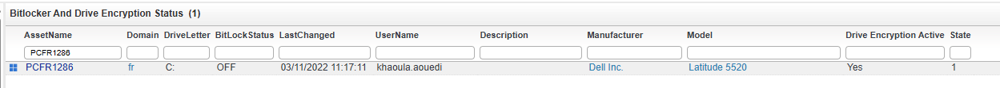
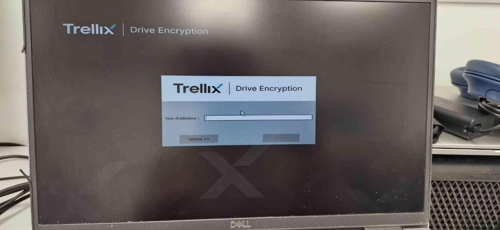
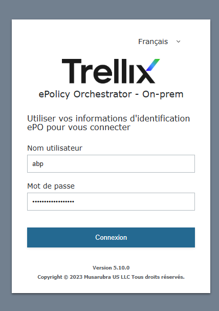
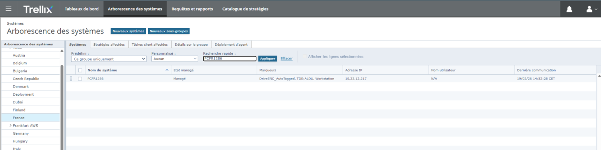
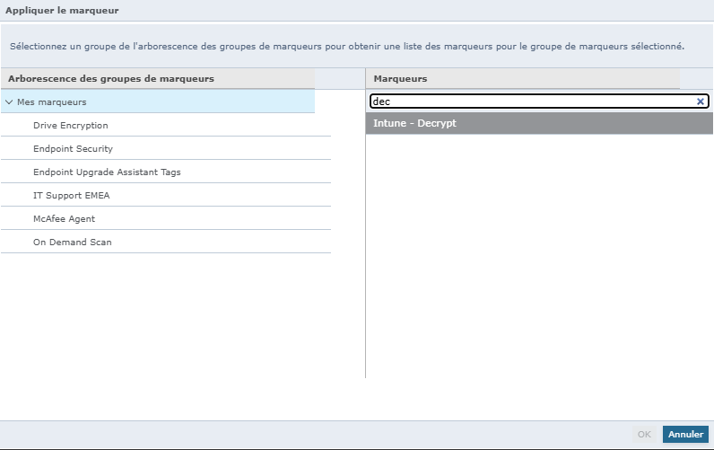
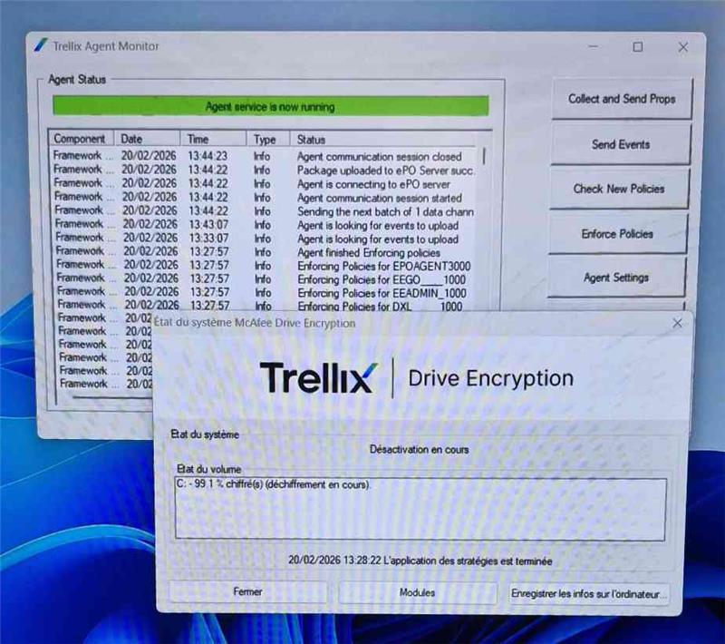
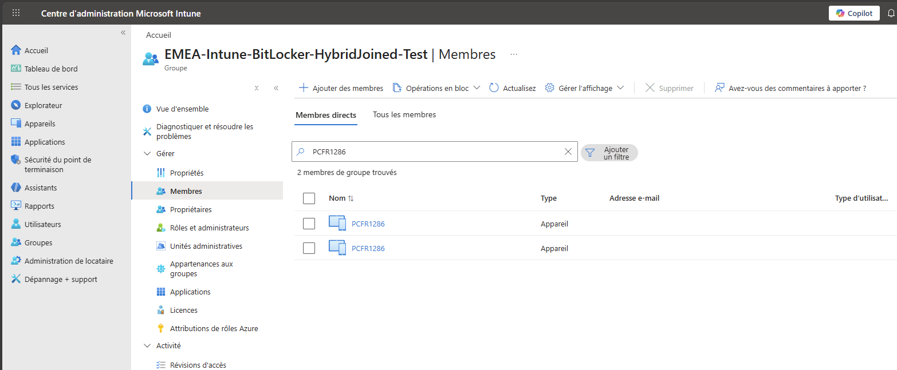
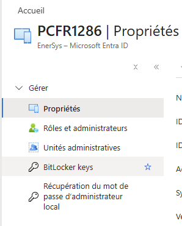

# Technical Procedure: Migrating from Trellix to BitLocker

## I. Introduction
This documentation describes the decryption of a disk currently encrypted with **Trellix Drive Encryption** in order to migrate it to **BitLocker**.

**Trellix** is a disk encryption solution that protects data stored on a computer by automatically encrypting it, preventing unauthorized access in case of theft, loss, or physical intrusion.

**BitLocker** is Windows' built-in full-disk encryption tool, natively integrated with Microsoft Intune and Entra ID for centralized key management.

---

## II. Unregistering Trellix

### 1. Verify Trellix is active — Admin side
First, check that Trellix Drive Encryption is still active on the target machine from the **ePolicy Orchestrator (ePO) admin dashboard**.

### 2. Verify Trellix is active — Client side
Confirm on the machine itself that Trellix is still the active encryption layer (the pre-boot authentication screen should appear at startup).

### 3. Connect to the Trellix ePO Dashboard
Log in to **Trellix ePolicy Orchestrator** using a **domain admin account**.

### 4. Locate the machine in the System Tree
Navigate to **System Tree → France** and search for the target PC by name. Verify that the machine's IP address is correctly tagged before proceeding.

### 5. Apply the Intune-Decrypt marker
With the machine selected, go to **Actions → Tag → Apply Tag** and apply the following marker: **Intune - Decrypt** (under the Drive Encryption marker group).

Click **OK** to confirm.

### 6. Update the Trellix Agent and wait for decryption
Open the **Trellix Agent Monitor** on the target machine and click **Enforce Policies** to trigger a policy sync with the ePO server. The agent will download the new decryption policy and begin the process.

Once decryption is complete, **restart the machine**.

---

## III. Encrypting with BitLocker

### 1. Enable BitLocker on the C: drive
On the machine (logged in with a local or domain admin account):
1. Open **File Explorer**
2. Right-click on **C:\\**
3. Select **Turn on BitLocker**
4. Follow the wizard and confirm encryption

### 2. Verify in Microsoft Intune — Group membership
In the **Microsoft Intune admin center**, navigate to the BitLocker group and confirm the machine appears in the member list.

### 3. Verify BitLocker key escrow in Entra ID
In **Microsoft Entra ID**, navigate to the device properties and confirm that a **BitLocker keys** entry is present — this confirms the recovery key has been successfully escrowed.

